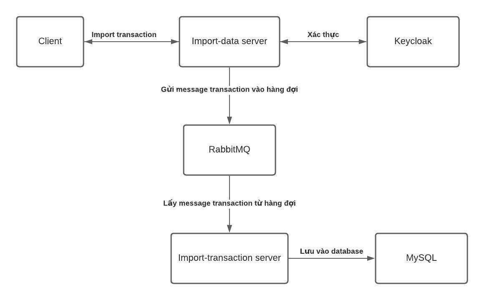

# Import Transaction

## Yêu cầu hệ thống
- NodeJs
- Docker

## Kiến trúc hệ thống


## Thư mục

- `import-data`: source code API nhận file từ client, gửi message vào RabbitMQ
- `import-transaction`: source code xử lý message trong hàng đợi của RabbitMQ
 
## Run source

- Copy file `.env.example` thành file `.env` ở các thư mục `import-data`, `import-transaction`
- Ở thư mục gốc của project. Gõ lệnh `docker-compose up -d --build`.
- Ở thư mục `import-data`. Chạy lệnh `npm run start`.
- Ở thư mục `import-transaction`. Chạy lệnh `npm run start`.


## Tạo tài khoản user trên Keycloak

- [Click để xem file hướng dẫn](Guideline_createuser_keycloak.docx)

## Lấy token thông qua api của keycloak

```
curl --location --request POST 'http://localhost:8080/auth/realms/demo/protocol/openid-connect/token' \
--header 'Content-Type: application/x-www-form-urlencoded' \
--data-urlencode 'client_id=import-transaction' \
--data-urlencode 'grant_type=password' \
--data-urlencode 'client_secret=528d44ee-56a3-48b8-be0f-0b386d9f8c8c' \
--data-urlencode 'scope=openid' \
--data-urlencode 'username={{username của user}}' \
--data-urlencode 'password={{password của user}}'
```
Chú thích:
- `{{username của user}}`: thay thế bằng username của user được tạo ở bước trên
- `{{password của user}}`: thay thế bằng password của user được tạo ở bước trên


## API Import transaction
```
curl --location --request POST 'localhost:3000/import-transaction/upload' \
--header 'Authorization: Bearer {{token của user}}' \
--form 'file=@"{{đường dẫn tuyệt đối của file}}"'
```

Chú thích
- `{{token của user}}`: Token của user được lấy ở bước trên
- `{{đường dẫn tuyệt đối của file}}`: Đường dẫn tuyệt đối của file cần import.
- Template file: [csv](./data.csv), [excel](./data.xlsx)
